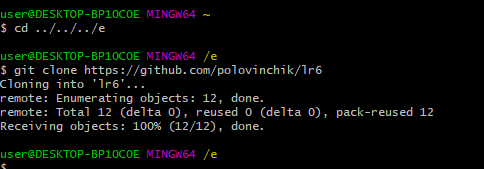
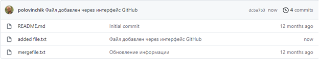
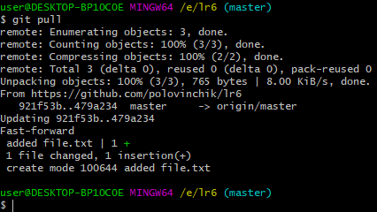
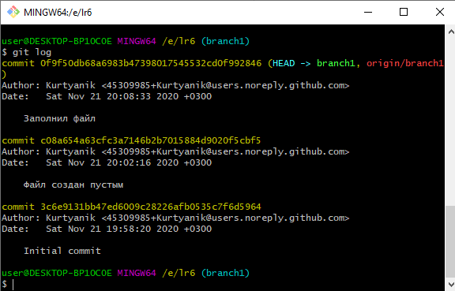
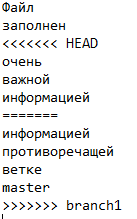
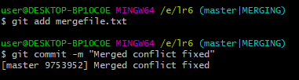
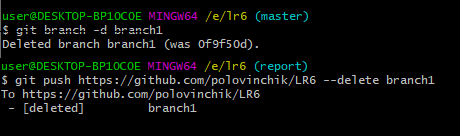
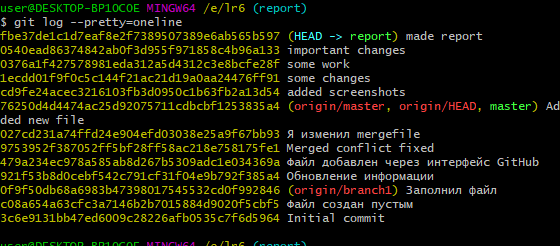

# Лабораторная работа №6
После регистрации на GitHub и установки Git созданием копию выданного репозитория в личное хранилище (Значек Fork)
Для начала работы необходимо настроить клиент git введя имя пользователя и командами `email git config --global user.name <username>` и `git config --global user.email <email>`

Затем необходимо клонировать удаленный репозиторий на компьютер командой `git clone <url>`

Добавляем файл через интерфейс GitHub

Подтягиваем изменения из удаленного репозитория командой `git pull`

Получаем историю операций из каждой ветки командой `git log`. Переключение веток с помощью `git checkout`

Выполняем слияние в ветку master командой `git merge <branch>`

Происхдит конфликт, для решения вручную меняем содержимое файла

Для индексирования файла используем `git add` и комита `git commit -m <message>` 

Затем необходимо удалить побочную ветку из локального репозитория `git branch -d <branch>` и удаленного репозитория `git push <url> --delete <branch>`

Делаем несколько изменений и фиксируем их с помощью `git add` и `git commit`

Необходимо сделать хард ресет коммита, для этого я сделал специальный коммит, открыт лог и командой `git reset --hard <commit>` откатился до предыдущей версии

Создал новую ветку для отчета и сразу переключился на нее `git checkout -b report` 

Затем принялся писать отчет в файле README.md, использую Markdown синтаксис.  

Получаем итоговую историю операций с помощью `git log`

После окончания написания отчета произвел команды `git add *` и `git commit -m "<text>"` и отправил изменения в удаленный репозиторий `git push <rep> <branch>`

